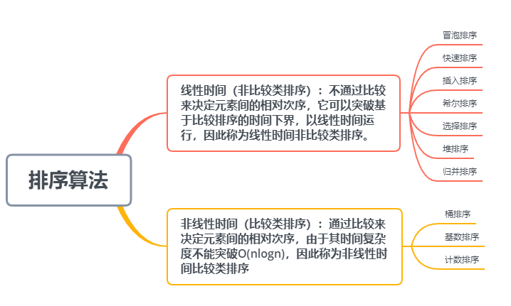
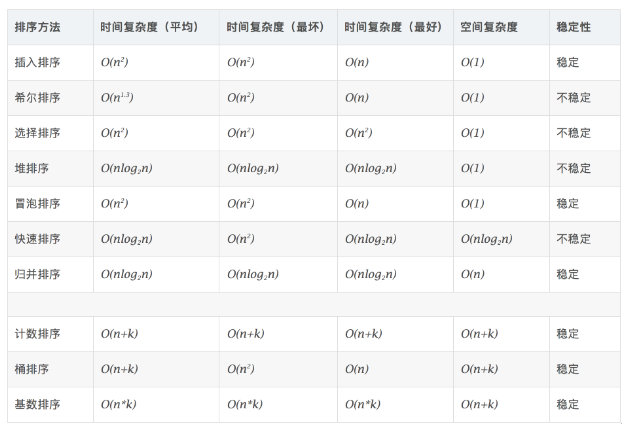

所谓排序，就是使一串记录，按照其中的某个或某些关键字的大小，递增或递减的排列起来的操作。排序算法，就是如何使得记录按照要求排列的方法。是《数据结构与算法》中最基本的算法之一。

> 我们常说的十大排序算法为：冒泡、选择、插入、希尔、归并、快速、堆、计数、桶、基数

## 基本分类

我们常根据是否可以在线性时间内比较对其分类：  

## 时间复杂度：

## 如何记忆时间复杂度呢？

1. 平方阶 (O(n2)) 插入、选择、冒泡
2. 线性对数阶 (O(nlog2n)) 快速、归并、堆
3. 特殊的希尔 O(n^(1.3—2))
4. 牛皮的线性 基数、桶、箱、计数

## 啥是稳定：

稳定：如果 a 原本在 b 前面，而 a=b，排序之后 a 仍然在 b 的前面。  
不稳定：如果 a 原本在 b 的前面，而 a=b，排序之后 a 可能会出现在 b 的后面。

## 哪些稳定：

稳定：冒泡、插入、归并和基数。
不稳定：选择、快速、希尔、堆。

**排序算法大纲**

1. [冒泡排序](1.bubbleSort.md)
2. [选择排序](2.selectionSort.md)
3. [插入排序](3.insertionSort.md)
4. [希尔排序](4.shellSort.md)
5. [归并排序](5.mergeSort.md)
6. [快速排序](6.quickSort.md)
7. [堆排序](7.heapSort.md)
8. [计数排序](8.countingSort.md)
9. [桶排序](9.bucketSort.md)
10. [基数排序](10.radixSort.md)

----